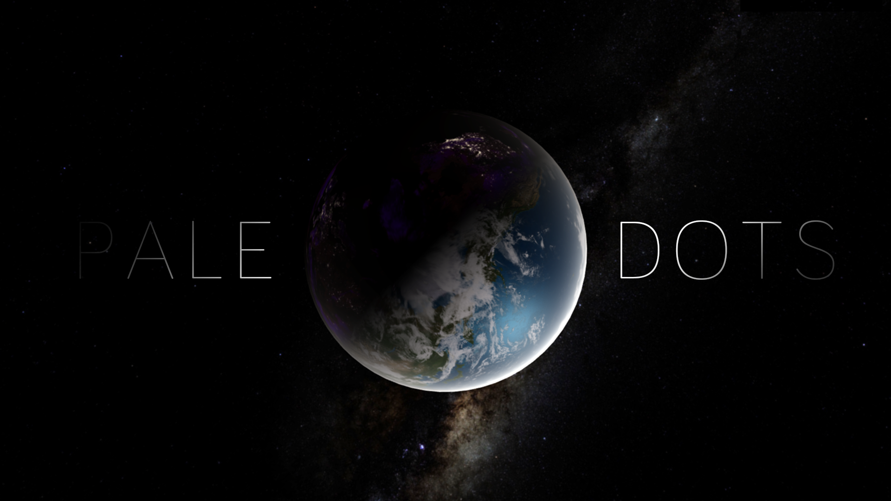
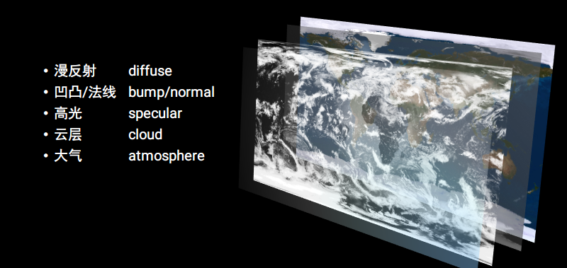
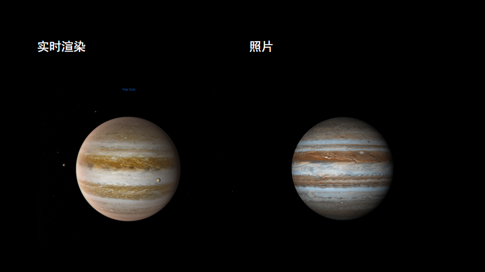
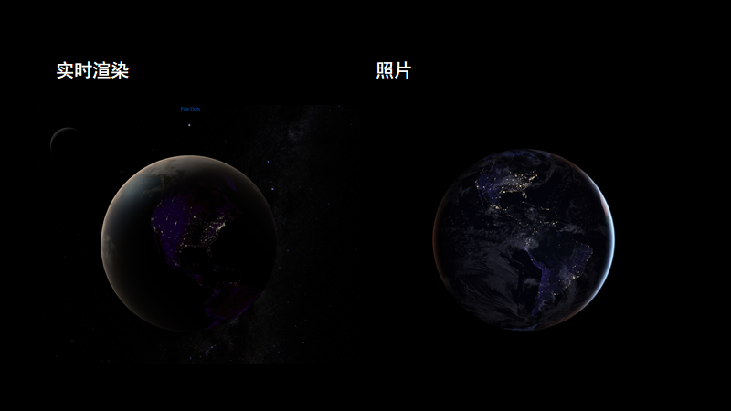
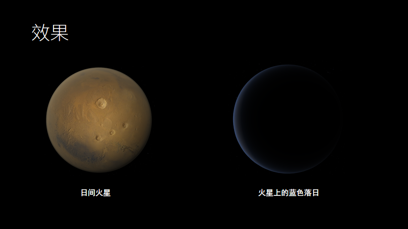

# The Pale Dots

基于three.js的太阳系模拟 [Github静态页面](https://solarcg.github.io/SolarSys/)

## 关于Pale Dots

> 仔细瞧它，便会看到一个小点。正是这个小点，是我们，是我们的家。你所熟识的人、所听闻存在过的人，都是在这里，度过了他们的一生。我们欢笑与苦难的总和，……物种史上所有的圣人和罪者，都曾在这粒尘埃之中，这粒茕孑于太阳光芒的尘埃之中。——卡尔·萨根《暗淡蓝点》

## 实现

- 接近于照片的真实感天体绘制
- 天体的运动、平滑切换动画
- 第一人称视角自由漫游
- 漫游碰撞检测和观察安全距离
- 逻辑与数据的分离，通过参数指定天体绘制
- 接近于物理大气散射模型的大气效果实现
- etc...

## 天体绘制

 

## 渲染效果

 

  

## 大气散射

 

 